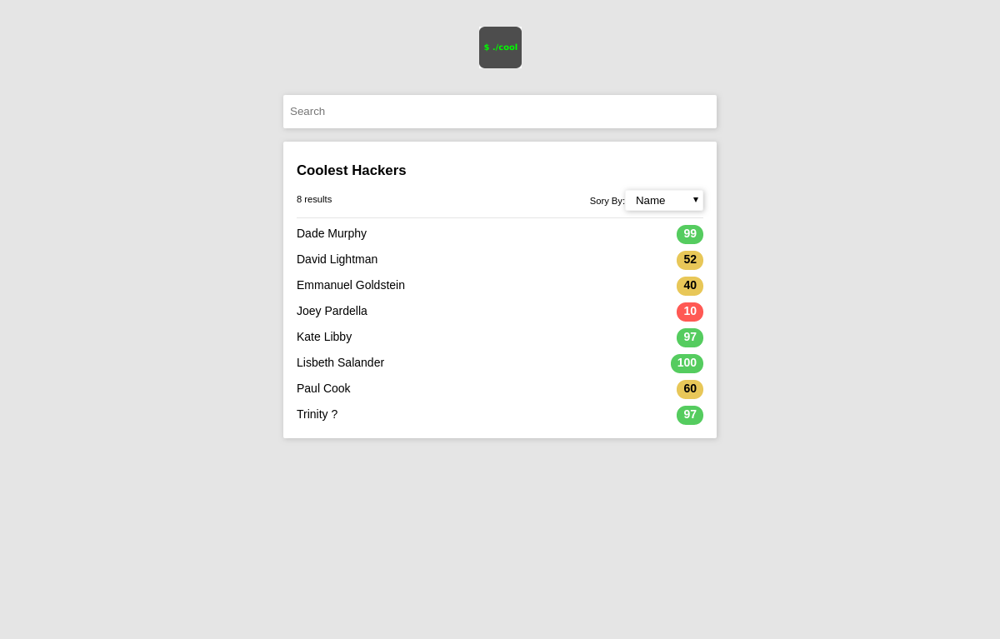

# Part 1: PureArray

In this part of the interview we're going to rewrite some common array methods using pure functions and some new ideas.

To get you to think in a different way and see how you adapt to new styles, we're going to create several restrictions on how you can code these functions.

## Restrictions

### No Array Methods

To start, you are not allowed to use any existing array functions or properties such as array.length, array.push(), array.concat().

### No Mutations

Secondly all functions must be pure functions. That means you can not modify any existing variables or data, you instead create new data based on old data.

### No loops

No for, no while.

## What CAN I use?

### Some built in features

if/else statements, ternaries, and constant variables (e.g. variables that do not change after they are initialized).

### The functions we give you

**isEmpty**: a simple function that returns whether or not the array is empty.

```
isEmpty([]) // true
isEmpty([1]) // false
isEmpty([1, 2, 3]) // false
```

#### Heads and Tails

**getHead**: returns the first element of an array

```
getHead([]) // Error! Can not get head of empty array.
getHead([1]) // 1
getHead(['a', 'b', 'c']) // 'a'
```

**getTail**: returns all elements of an array after the first element in a new array.

```
getTail([]) // Error! Can not get tail of empty array.
getTail([1]) // []
getTail(['a', 'b', 'c']) // ['b', 'c']
```

**buildArray**: returns a new array by combining a head with a tail to form a new array

```
buildArray(1, []) // [1]
buildArray(1, [2]) // [1, 2]
buildArray(1, [2, 3, 4]) // [1, 2, 3, 4]
```

### Recursion

```
const hello = () => {
  console.log('This prints forever!')
  hello();
};
```

# Part 2: Hacker Search


